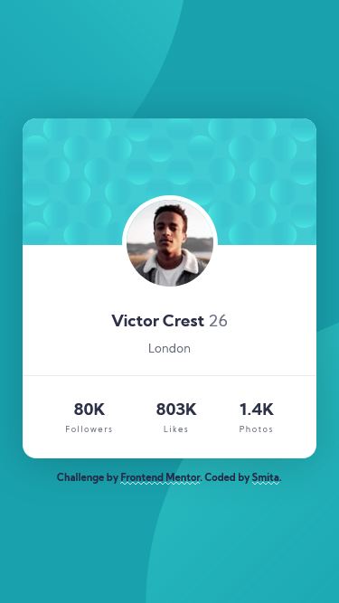
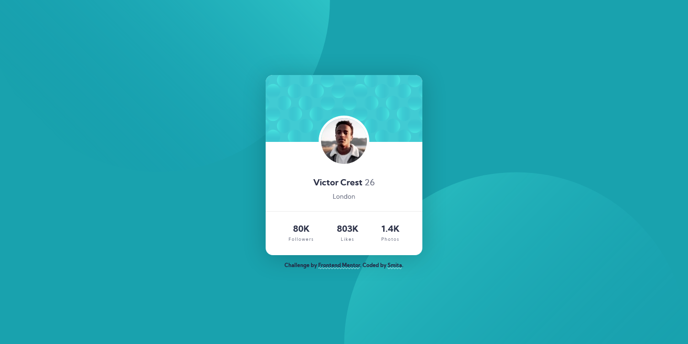

# Frontend Mentor - Profile card component solution

This is a solution to the [Profile card component challenge on Frontend Mentor](https://www.frontendmentor.io/challenges/profile-card-component-cfArpWshJ). Frontend Mentor challenges help you improve your coding skills by building realistic projects. 

## Table of contents

- [Overview](#overview)
  - [The challenge](#the-challenge)
  - [Screenshots](#screenshots)
  - [Links](#links)
- [My process](#my-process)
  - [Built with](#built-with)
- [Author](#author)
- [Acknowledgments](#acknowledgments)

## Overview

### The challenge

- Build out the project to the designs provided

### Screenshots

| **Mobile Design** | **My Solution** |
| -- | -- |
|  |  |

| **Desktop Design** |
| :--: |
|  |
| **My Solution** |
|  | 

### Links

- Solution URL: [Solution on FrontendMentor.io](https://www.frontendmentor.io/solutions/mobilefirst-bem-and-css-flexbox-fJ_jjaLWV)
- Live Site URL: [Live site preview](https://smita-14.github.io/profile-card-component-challenge/)

## My process

### Built with

- Semantic HTML5 markup
- CSS custom properties
- Flexbox
- BEM architecture
- Mobile-first workflow

## Author

- Frontend Mentor - [@Smita-14](https://www.frontendmentor.io/profile/Smita-14)

## Acknowledgments
A great big thanks to [Frontend Mentor](https://www.frontendmentor.io) and it's team for building a community where we can learn, share and grow with amazing people! 💖💖
